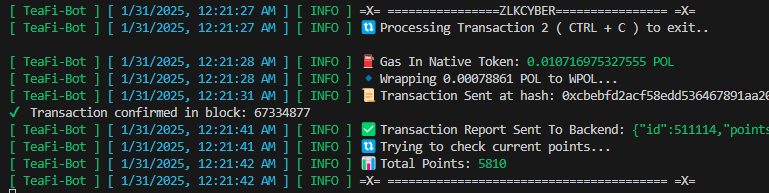

# TeaFi BOT AUTO TX


## How ?

- Register here using your wallet: [https://tea-fi.com/tea-party/](https://app.tea-fi.com/?ref=v6hrgs)

## Requirements

- **Node.js**: Ensure you have Node.js installed.
- **npm**: Ensure you have npm installed.
- **POL Balance**: Ensure you have a pol balance in polygon/matic network

## Setup

1. Clone this repository:
   ```bash
   git clone https://github.com/Zlkcyber/teaFiBot.git
   cd teaFiBot
   ```
2. Install dependencies:
   ```bash
   npm install
   ```
3. Fill your wallet privKey in `.env` format `PRIVATE_KEY=your_private_key`
    ```bash
    cp .env-example .env && nano .env
    ```
4. Run The Script:
   ```bash
   npm run start
   ```
   
## 

This project is licensed under the [MIT License](LICENSE).